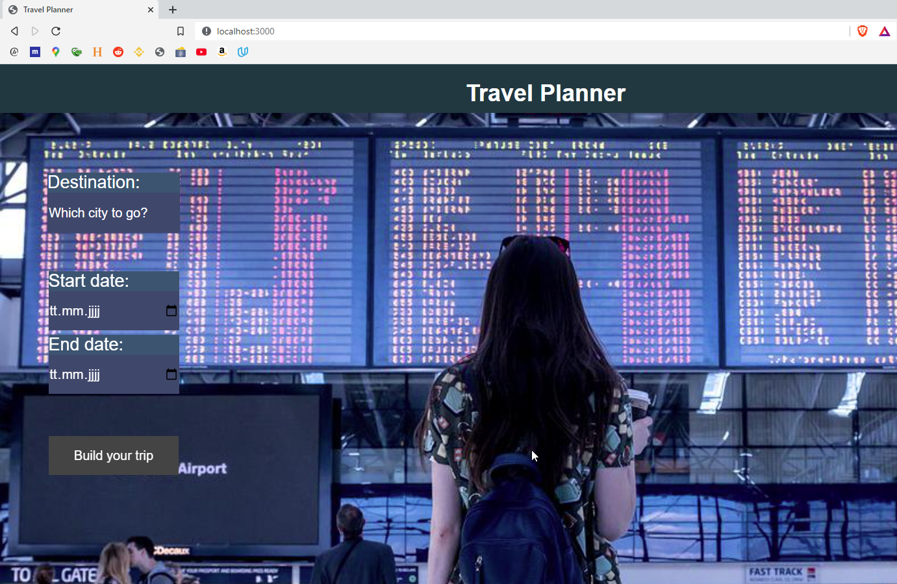

# Overview

final Capstone project from fend-course.
goal is to combine all skills learned from previous projects.

## Things I did:

* copied code from lesson3
* added webpack
* added code from lesson4
* made accounts with three API as requested
* added all of them in the code & .env file
* created stupidly complex functions to create new entries on the webpage, when you enter a destination and some dates
* added multiple new additions to npm

### Which files were touched?

all of them.

#### The result

The page when you enter it:

One of the possible error messages:

Multiple trips displayed at once:

